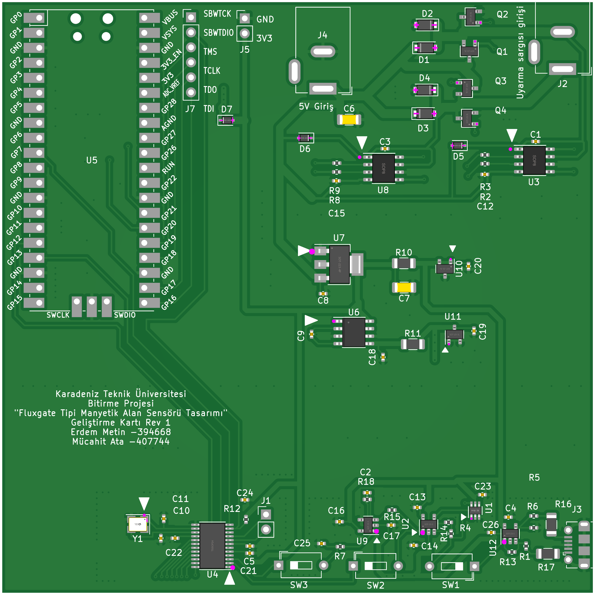
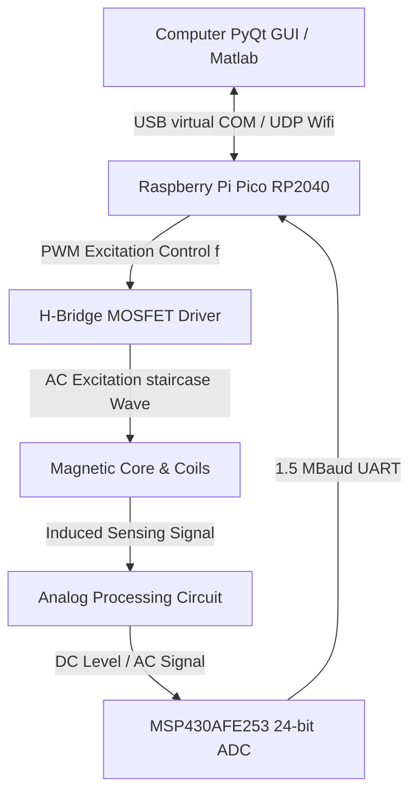

# 🧲 High-Precision Fluxgate Magnetic Field Sensor Design

An open-source, high-sensitivity, single-axis Fluxgate magnetometer and development platform designed for aerospace, geophysics, and navigation applications. This project implements a fully integrated system containing hardware (KiCad PCBs), firmware (MSP430 24-bit SD-ADC & RP2040 Controller), simulations (LTSpice), and software (Python PyQt real-time GUI).

Developed as a senior capstone engineering project at **Karadeniz Technical University (KTU)** by **Erdem Metin** and **Mücahit Ata**, under the supervision of **Prof. Dr. İsmail Kaya**.

---

## 📸 System Overview

The Fluxgate sensor system is designed around a dual-MCU architecture consisting of an **RP2040** (master controller and driver) and an **MSP430AFE253** (24-bit Sigma-Delta ADC data acquisition).


*Fig 1: Full system schematic diagram detailing all MCU pinouts, power distribution, and analog filters.*

<p align="center">
  
  
</p>
*Fig 2: KiCad PCB 3D layout render (left) and the fully assembled physical testing board (right).*



---

## 📖 Theory of Operation

A **Fluxgate Magnetometer** measures weak static or low-frequency magnetic fields (in the nT to µT range) by exploiting the non-linear magnetic saturation characteristics of a ferromagnetic core.

1. **Excitation (Drive):** An AC current at frequency $f$ drives the core deep into saturation in both positive and negative directions.
2. **Symmetric Core State:** In the absence of an external magnetic field, the magnetic flux changes symmetrically. The voltage induced in the sensing (pick-up) coil contains only **odd harmonics** ($3f$, $5f$, etc.).
3. **Asymmetric Core State (External Field Present):** When an external magnetic field (like the Earth's field $H_{ext}$) is present, it biases the core, causing it to saturate earlier in one direction and later in the other.
4. **Second Harmonic (2f) Detection:** This asymmetry generates **even harmonics** (predominantly the $2f$ component) in the sensing coil. The amplitude of this second harmonic is directly proportional to the magnitude of the external magnetic field, and its phase indicates the field's direction.

---

## 🛠️ Project Structure

The repository is structured into logically separated folders to make implementation and replication straightforward:

*   📁 **[`Hardware/`](file:///c:/Users/ASUS/Desktop/Fluxgate/Fluxgate-Project-Files/Hardware)**: KiCad schematic and PCB layout designs, Gerber files, and Bill of Materials (BOM).
*   📁 **[`Firmware/`](file:///c:/Users/ASUS/Desktop/Fluxgate/Fluxgate-Project-Files/Firmware)**:
    *   **MSP430:** IAR and CCS projects for 24-bit Sigma-Delta ADC sampling at 16.5 kSps and 1.5 MBaud USART transmission.
    *   **RP2040 (Raspberry Pi Pico):** C/C++ SDK projects generating precise excitation PWM and streaming data to PC via USB Serial or UDP Wi-Fi.
*   📁 **[`Software/`](file:///c:/Users/ASUS/Desktop/Fluxgate/Fluxgate-Project-Files/Software)**: Python-based GUI utilizing `pyqtgraph` for real-time serial and UDP plotting, and Matlab analytics.
*   📁 **[`Simulations/`](file:///c:/Users/ASUS/Desktop/Fluxgate/Fluxgate-Project-Files/Simulations)**: LTSpice circuits simulating the H-Bridge excitation driver and the analog synchronous demodulation path.

---

## 🚀 Step-by-Step Build & Replication Guide

To replicate and build this high-precision Fluxgate sensor, follow these five steps:

### 1. Hardware Fabrication & Assembly
1. Go to **[`Hardware/`](file:///c:/Users/ASUS/Desktop/Fluxgate/Fluxgate-Project-Files/Hardware)** and select either the **Excitation Circuit V1**, the **Excitation Circuit Final**, or the **JLCPCB Version** which is optimized for SMT assembly.
2. Export Gerbers or use the provided `.zip` files under the directories to order PCBs from your manufacturer (e.g., JLCPCB).
3. Assemble the PCB using the BOM. Key components include:
    *   **Primary Controller:** Raspberry Pi Pico (RP2040)
    *   **Precision ADC:** MSP430AFE253IPW (24-bit Sigma-Delta ADC)
    *   **H-Bridge Driver:** HIP4082xB half-bridge gate driver
    *   **Excitation MOSFETs:** AP2300 or IRFZ44N
    *   **Ultra Low-Noise Opamps:** TP2311 or LT149x series (12nV/√Hz input noise)
    *   **Voltage References:** AN431 shunt regulators (2.5V, 20ppm/°C stability)

### 2. Fluxgate Core & Coil Preparation
1. **Core Selection:** Use a high-permeability toroidal core. While 6-81 Permalloy (81% Ni, 6% Mo) race-track cores yield the absolute lowest noise, a standard **high-permeability ferrite toroid** (e.g., 7mm ID, 2mm thick, 4.5mm high) provides a robust and easily windable core for prototyping.
2. **Drive Winding:** Wind the excitation coil uniformly around the toroid using **32 AWG** enameled copper wire.
3. **Sense Winding:** Wind the sensing coil on top of the drive winding, oriented to capture the flux gate effect effectively while canceling out the direct coupling from the excitation drive.


*Fig 3: The custom hand-wound toroidal fluxgate core integrated onto the testing board.*

### 3. Simulation & Validation
1. Open **[`Simulations/LTSpice/`](file:///c:/Users/ASUS/Desktop/Fluxgate/Fluxgate-Project-Files/Simulations)**.
2. Run `fluxgate.asc` to simulate the H-Bridge excitation path. Verify the staircase voltage waveform across the drive bobbin.
3. Run `fluxgateACAnaliz.asc` or `Draft7.asc` to analyze the frequency response of the active integrator and synchronous demodulator. Ensure the integration region lies between **159 Hz and 1591 Hz** and the low-pass filter kesim frekansı is configured near **28 Hz**.

### 4. Firmware Deployment
1. **MSP430 Firmware:**
    *   Open IAR Embedded Workbench or Code Composer Studio.
    *   Load the project in **[`Firmware/MSP430_AFE_ADC/`](file:///c:/Users/ASUS/Desktop/Fluxgate/Fluxgate-Project-Files/Firmware/MSP430_AFE_ADC)** or **[`Firmware/MSP430_ADC_to_UART/`](file:///c:/Users/ASUS/Desktop/Fluxgate/Fluxgate-Project-Files/Firmware/MSP430_ADC_to_UART)**.
    *   Compile and flash the firmware using an eZ-FET debugger (or the Spy-Bi-Wire pins on an MSP430 Launchpad).
    *   *Function:* Configures the 12MHz MCLK, initializes the SD24 Module in group conversion mode, and streams 24-bit raw ADC readings via USART0 at **1.5M Baud**.
2. **RP2040 Firmware:**
    *   Navigate to **[`Firmware/Pico_Firmwares/`](file:///c:/Users/ASUS/Desktop/Fluxgate/Fluxgate-Project-Files/Firmware/Pico_Firmwares)**.
    *   Choose either `pico-custom-firmware-usb` (USB Virtual Serial) or `pico-custom-firmware-udp` (Wi-Fi streaming).
    *   Build the project using the Pico SDK (`CMake`) and flash the resulting `.uf2` file onto your Pi Pico.
    *   *Function:* Emits precise complementary PWM drive signals (80µs duty, 40µs dead-time) at frequency $f$ to drive the H-Bridge. It uses a **PIO state machine** to reliably capture the 1.5MBaud UART stream from the MSP430 and forwards it to the PC.

### 5. GUI & Visualization
1. Install Python 3 and requirements:
   ```bash
   pip install pyqtgraph PyQt5 pyserial numpy
   ```
2. Run the visualization app in **[`Software/Python_GUI_Demo/`](file:///c:/Users/ASUS/Desktop/Fluxgate/Fluxgate-Project-Files/Software/Python_GUI_Demo)**:
   ```bash
   python compass.py
   # or
   python pyqtgraph_float_v2x2_yesim.py
   ```
3. Connect your Pi Pico to the PC via USB. You will see a real-time rolling graph of the 24-bit sampled magnetic field data representing the external field.

---

## ⚡ Specifications

| Parameter | Value | Description |
| :--- | :--- | :--- |
| **Sensor Type** | Parallel Fluxgate | Single Axis Magnetometer |
| **Excitation Waveform** | AC Staircase Wave | Minimizes transient EMF spikes |
| **Excitation Frequency** | 12.5 kHz | Configurable via Pico PWM registers |
| **ADC Resolution** | 24-Bit | Sigma-Delta Converter (MSP430AFE253) |
| **Sampling Rate** | ~16,500 samples/sec | High-speed oversampled stream |
| **Baud Rate** | 1,500,000 Baud | High-speed MSP430 to RP2040 UART link |
| **Demodulator Gain** | 1:10 (or 20 Differential) | Synchronous analog SPDT demodulation |
| **Low-Pass Filter (LPF)** | $f_c = 28.42\text{ Hz}$ | Eliminates grid noise (50Hz) and ripples |
| **Integrator Bandwidth** | 159 Hz to 1591 Hz | Limits noise and captures second harmonics |

---

## ⚖️ License

This project is open-source and released under the [MIT License](file:///c:/Users/ASUS/Desktop/Fluxgate/Fluxgate-Project-Files/LICENSE). Feel free to use, modify, and distribute for personal, academic, or commercial purposes.
