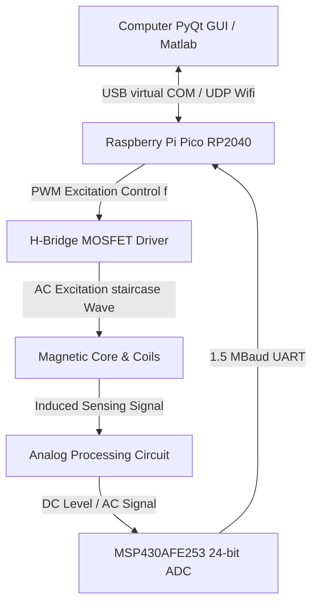

# 🧲 High-Precision Fluxgate Magnetic Field Sensor Design

An open-source, high-sensitivity, single-axis Fluxgate magnetometer and development platform designed for aerospace, geophysics, and navigation applications. This project implements a fully integrated system containing hardware (KiCad PCBs), firmware (MSP430 24-bit SD-ADC & RP2040 Controller), simulations (LTSpice), and software (Python PyQt real-time GUI).

Developed as a senior capstone engineering project at **Karadeniz Technical University (KTU)** by **Erdem Metin** and **Mücahit Ata**, under the supervision of **Prof. Dr. İsmail Kaya**.

---

## 📸 System Overview

The Fluxgate sensor system is designed around a dual-MCU architecture consisting of an **RP2040** (master controller and driver) and an **MSP430AFE253** (24-bit Sigma-Delta ADC data acquisition).


*Fig 1: Full system schematic diagram detailing all MCU pinouts, power distribution, and analog filters.*

<p align="center">
  
  
</p>
*Fig 2: KiCad PCB 3D layout render (left) and the fully assembled physical testing board (right).*



---

## 📖 Theory of Operation

A **Fluxgate Magnetometer** measures weak static or low-frequency magnetic fields (in the nT to µT range) by exploiting the non-linear magnetic saturation characteristics of a ferromagnetic core.

1. **Excitation (Drive):** An AC current at frequency $f$ drives the core deep into saturation in both positive and negative directions.
2. **Symmetric Core State:** In the absence of an external magnetic field, the magnetic flux changes symmetrically. The voltage induced in the sensing (pick-up) coil contains only **odd harmonics** ($3f$, $5f$, etc.).
3. **Asymmetric Core State (External Field Present):** When an external magnetic field (like the Earth's field $H_{ext}$) is present, it biases the core, causing it to saturate earlier in one direction and later in the other.
4. **Second Harmonic (2f) Detection:** This asymmetry generates **even harmonics** (predominantly the $2f$ component) in the sensing coil. The amplitude of this second harmonic is directly proportional to the magnitude of the external magnetic field, and its phase indicates the field's direction.

---

## 🛠️ Project Structure

The repository is structured into logically separated folders to make implementation and replication straightforward:

*   📁 **[`Hardware/`](file:///c:/Users/ASUS/Desktop/Fluxgate/Fluxgate-Project-Files/Hardware)**: KiCad schematic and PCB layout designs, Gerber files, and Bill of Materials (BOM).
*   📁 **[`Firmware/`](file:///c:/Users/ASUS/Desktop/Fluxgate/Fluxgate-Project-Files/Firmware)**:
    *   **MSP430:** IAR and CCS projects for 24-bit Sigma-Delta ADC sampling at 16.5 kSps and 1.5 MBaud USART transmission.
    *   **RP2040 (Raspberry Pi Pico):** C/C++ SDK projects generating precise excitation PWM and streaming data to PC via USB Serial or UDP Wi-Fi.
*   📁 **[`Software/`](file:///c:/Users/ASUS/Desktop/Fluxgate/Fluxgate-Project-Files/Software)**: Python-based GUI utilizing `pyqtgraph` for real-time serial and UDP plotting, and Matlab analytics.
*   📁 **[`Simulations/`](file:///c:/Users/ASUS/Desktop/Fluxgate/Fluxgate-Project-Files/Simulations)**: LTSpice circuits simulating the H-Bridge excitation driver and the analog synchronous demodulation path.

---

## 🚀 Step-by-Step Build & Replication Guide

To replicate and build this high-precision Fluxgate sensor, follow these five steps:

### 1. Hardware Fabrication & Assembly
1. Go to **[`Hardware/`](file:///c:/Users/ASUS/Desktop/Fluxgate/Fluxgate-Project-Files/Hardware)** and select either the **Excitation Circuit V1**, the **Excitation Circuit Final**, or the **JLCPCB Version** which is optimized for SMT assembly.
2. Export Gerbers or use the provided `.zip` files under the directories to order PCBs from your manufacturer (e.g., JLCPCB).
3. Assemble the PCB using the BOM. Key components include:
    *   **Primary Controller:** Raspberry Pi Pico (RP2040)
    *   **Precision ADC:** MSP430AFE253IPW (24-bit Sigma-Delta ADC)
    *   **H-Bridge Driver:** HIP4082xB half-bridge gate driver
    *   **Excitation MOSFETs:** AP2300 or IRFZ44N
    *   **Ultra Low-Noise Opamps:** TP2311 or LT149x series (12nV/√Hz input noise)
    *   **Voltage References:** AN431 shunt regulators (2.5V, 20ppm/°C stability)

### 2. Fluxgate Core & Coil Preparation
1. **Core Selection:** Use a high-permeability **green iron-powder ferrite toroid core** with an **inner diameter of 7 mm, thickness of 2 mm, and height of 4.5 mm**. (While a 6-81 Permalloy racetrack core with $100\text{ µm}$ laminations provides lower noise, a toroidal ferrite core is robust and hand-windable).
2. **Drive Winding:** Wind the excitation (drive) coil uniformly around the toroid using **32 AWG** enameled copper wire. In the experimental prototype, the completed drive winding exhibited a measured **series resistance of $17.945\text{ }\Omega$** and a **series inductance of $19.686\text{ mH}$**.
3. **Sense Winding:** Wind the sensing (pick-up) coil on top of the drive winding, orienting the windings to capture the fluxgate effect while canceling direct coupling from the excitation drive.


*Fig 3: The custom hand-wound toroidal fluxgate core integrated onto the testing board.*

### 3. Simulation & Validation
1. Open **[`Simulations/LTSpice/`](file:///c:/Users/ASUS/Desktop/Fluxgate/Fluxgate-Project-Files/Simulations)**.
2. Run `fluxgate.asc` to simulate the H-Bridge excitation path. Verify the staircase voltage waveform across the drive bobbin.
3. Run `fluxgateACAnaliz.asc` or `Draft7.asc` to analyze the frequency response of the active integrator and synchronous demodulator. Ensure the integration region lies between **159 Hz and 1591 Hz** and the low-pass filter kesim frekansı is configured near **28 Hz**.

### 4. Firmware Deployment
1. **MSP430 Firmware:**
    *   Open IAR Embedded Workbench or Code Composer Studio.
    *   Load the project in **[`Firmware/MSP430_AFE_ADC/`](file:///c:/Users/ASUS/Desktop/Fluxgate/Fluxgate-Project-Files/Firmware/MSP430_AFE_ADC)** or **[`Firmware/MSP430_ADC_to_UART/`](file:///c:/Users/ASUS/Desktop/Fluxgate/Fluxgate-Project-Files/Firmware/MSP430_ADC_to_UART)**.
    *   Compile and flash the firmware using an eZ-FET debugger (or the Spy-Bi-Wire pins on an MSP430 Launchpad).
    *   *Function:* Configures the 12MHz MCLK, initializes the SD24 Module in group conversion mode, and streams 24-bit raw ADC readings via USART0 at **1.5M Baud**.
2. **RP2040 Firmware:**
    *   Navigate to **[`Firmware/Pico_Firmwares/`](file:///c:/Users/ASUS/Desktop/Fluxgate/Fluxgate-Project-Files/Firmware/Pico_Firmwares)**.
    *   Choose either `pico-custom-firmware-usb` (USB Virtual Serial) or `pico-custom-firmware-udp` (Wi-Fi streaming).
    *   Build the project using the Pico SDK (`CMake`) and flash the resulting `.uf2` file onto your Pi Pico.
    *   *Function:* Emits precise complementary PWM drive signals (80µs duty, 40µs dead-time) at frequency $f$ to drive the H-Bridge. It uses a **PIO state machine** to reliably capture the 1.5MBaud UART stream from the MSP430 and forwards it to the PC.

### 5. GUI & Visualization
1. Install Python 3 and requirements:
   ```bash
   pip install pyqtgraph PyQt5 pyserial numpy
   ```
2. Run the visualization app in **[`Software/Python_GUI_Demo/`](file:///c:/Users/ASUS/Desktop/Fluxgate/Fluxgate-Project-Files/Software/Python_GUI_Demo)**:
   ```bash
   python compass.py
   # or
   python pyqtgraph_float_v2x2_yesim.py
   ```
3. Connect your Pi Pico to the PC via USB. You will see a real-time rolling graph of the 24-bit sampled magnetic field data representing the external field.

---

## 📡 Digital Signal Processing (DSP) & Digital Lock-In Mode

During the final experimental testing phase of this project, the analog op-amps in the physical synchronous demodulation circuit were found to be defective or counterfeit, preventing analog phase detection from working out of the box. To solve this, the project utilized a highly robust **Digital Signal Processing (DSP)** pipeline to bypass the analog demodulator entirely.

### Bypassing the Analog Demodulator
1. The analog SPDT switch (SN74LVC1G3157) was disabled (tied to a static ground state via the MCU).
2. The active low-noise op-amps were configured as a simple differential preamplifier.
3. The raw, high-speed AC signal (which contains the even and odd harmonics) was fed directly into the **MSP430's 24-bit Sigma-Delta ADC**.
4. The raw, un-demodulated samples were digitized at ~16.5 kSps and streamed to the PC via the RP2040 UART/USB bridge.

### Two Host-Side Digital Processing Implementations
Your software repository implements two distinct mathematical approaches on the host PC to extract the external magnetic field from this raw stream:

1. **Frequency-Domain Demodulation (Real-Time FFT):**
   * *File:* **[`pyqtgraph_float_v2x2_yesim.py`](file:///c:/Users/ASUS/Desktop/Fluxgate/Fluxgate-Project-Files/Software/Python_GUI_Demo/pyqtgraph_float_v2x2_yesim.py)**
   * *Method:* Computes a high-performance **Fast Fourier Transform (FFT)** on blocks of 8192 raw samples using Scipy:
     ```python
     Yf0 = fft(ch0)
     ```
   * *Result:* The GUI displays the real-time frequency spectrum. By measuring the amplitude peak of the **second harmonic ($2f$ at 25 kHz)** in the frequency domain, the software calculates the precise external magnetic field intensity, completely replacing the physical analog lock-in filters!

2. **Time-Domain Smoothing (Moving Average Convolution):**
   * *Files:* **[`udp_plot_pyqt.py`](file:///c:/Users/ASUS/Desktop/Fluxgate/Fluxgate-Project-Files/Software/Python_GUI_Demo/udp_plot_pyqt.py)** and **[`udp_plot_pyqt_2.py`](file:///c:/Users/ASUS/Desktop/Fluxgate/Fluxgate-Project-Files/Software/Python_GUI_Demo/udp_plot_pyqt_2.py)**
   * *Method:* Unpacks the high-speed telemetry and applies a real-time **Moving Average Filter** using NumPy convolution across a 1000-sample window:
     ```python
     filtered_data = np.convolve(data, weights, mode='valid')
     ```
   * *Result:* Smooths out the excitation switching ripples and transient spikes, feeding a clean time-domain signal to the graphical compass needle interface to dynamically show the core's magnetic orientation.

---

## 🛠️ Hardware Debugging & Engineering Solutions

During the assembly and testing phase, two critical engineering challenges arose and were systematically resolved:

### 1. The H-Bridge Bootstrap Capacitor & Duty Cycle Adaptation
*   **The Issue:** High-side gate drivers require a bootstrap capacitor ($C_{Bst}$) to maintain the gate-to-source voltage ($V_{GS}$) when the high-side MOSFET turns on. By design guidelines, the minimum bootstrap capacitance is:
    $$C_{Bst} = \frac{Q_{gate}}{\Delta V_{Bst}}$$
    Using the AP2300 gate charge $Q_{gate} = 11\text{ nC}$ and an acceptable voltage ripple $\Delta V_{Bst} = 0.1\text{ V}$, the minimum capacitor required is $110\text{ nF}$. Due to a design oversight, a **$1\text{ nF}$** capacitor was initially populated. This capacitor discharged instantly, causing the high-side gate drivers to drop out immediately.
*   **The Fix:** Populating a **$1\text{ µF}$** capacitor resolved the gate-dropout issue. However, experimental tests under a $330\text{ }\Omega$ load revealed that the high-side gate could remain continuously open for a maximum of **$1.125\text{ ms}$** before the bootstrap charge depleted.
*   **PWM Adaptation:** To prevent the high-side gate from collapsing during lower frequencies, the RP2040 firmware was adapted to emit a highly optimized PWM excitation pattern. Instead of a basic symmetrical square wave, the drive cycle was structured as:
    *   **$0.8\text{ ms}$ Positive Drive Phase** (containing high-speed $80\text{ µs}$ pulses with $40\text{ µs}$ dead-times).
    *   **$0.4\text{ ms}$ Neutral Phase** (H-bridge disabled, allowing the bootstrap capacitors to fully recharge).
    *   **$0.8\text{ ms}$ Negative Drive Phase** (H-bridge reversed).

### 2. Defective Analog Op-Amps & DSP Bypass
*   **The Issue:** During board validation, short-circuiting the sensing coil to ground resulted in the low-noise differential preamplifier and active integrator output locks stuck at a solid **$2.5\text{ V}$** (the virtual ground analog reference voltage). The op-amps (TP2311 or LT1492) failed to respond to any AC or DC input signal changes, leading to the conclusion that the physical components received were defective or counterfeit.
*   **The Solution:** The analog synchronous SPDT demodulator switch (SN74LVC1G3157) was set to ground mode via the RP2040, transforming the first stage into a simple, highly linear $1:2$ differential preamplifier (total differential gain of 20). The raw, high-speed AC pick-up signal was routed directly into the MSP430's 24-bit Sigma-Delta ADC, and the entire lock-in and filtering cascade was bypassed in hardware and reconstructed in real-time software on the host PC.

---

## ⚡ Specifications

| Parameter | Value | Description |
| :--- | :--- | :--- |
| **Sensor Type** | Parallel Fluxgate | Single Axis Magnetometer |
| **Excitation Waveform** | AC Staircase Wave | Minimizes transient EMF spikes |
| **Excitation Frequency** | 12.5 kHz | Configurable via Pico PWM registers |
| **ADC Resolution** | 24-Bit | Sigma-Delta Converter (MSP430AFE253) |
| **Sampling Rate** | ~16,500 samples/sec | High-speed oversampled stream |
| **Baud Rate** | 1,500,000 Baud | High-speed MSP430 to RP2040 UART link |
| **Demodulator Gain** | 1:10 (or 20 Differential) | Synchronous analog SPDT demodulation |
| **Low-Pass Filter (LPF)** | $f_c = 28.42\text{ Hz}$ | Eliminates grid noise (50Hz) and ripples |
| **Integrator Bandwidth** | 159 Hz to 1591 Hz | Limits noise and captures second harmonics |

---

## ⚖️ License

This project is open-source and released under the [MIT License](file:///c:/Users/ASUS/Desktop/Fluxgate/Fluxgate-Project-Files/LICENSE). Feel free to use, modify, and distribute for personal, academic, or commercial purposes.
